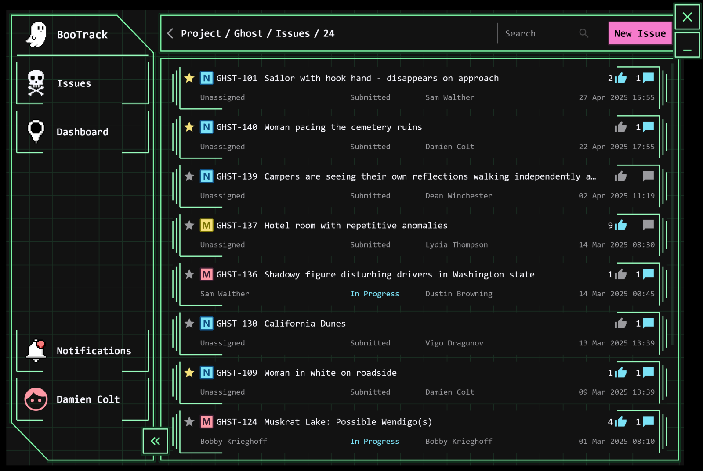

# :ghost::mag_right: BooTrack

This is a sample Compose Multiplatform for desktop project accompanying the KotlinConf 2025 talk for the [Exposed library](https://github.com/JetBrains/Exposed).
It mimics a simplified project-issue tracker model, reminiscent of [YouTrack](https://youtrack.jetbrains.com/issues/EXPOSED).

## Run Desktop Application (using JDBC)
* Run Ktor Gradle task `buildFatJar`
* Run `docker compose up`
* The server responds at http://127.0.0.1:8080 to check [routes](shared/src/commonMain/kotlin/dev/bogwalk/bootrack/routes/Resources.kt), if needed.
    * See details about the Ktor server application in the `backend-jdbc` module
    * See details about the Ktor HttpClient in the `composeApp/commonMain/../client` package
* Once the server has started, run `Main.kt` from the `composeApp/desktopMain`: task `main [desktop]`

**Note** that the default data access approach is set to the Domain Specific Language (DSL) approach.
This can be changed to the Data Access Object (DAO) approach in `application.conf` by commenting out the desired `dataAccess` property.

**Note** that the server will automatically shut down as a part of the application exit process.

## Run Desktop Application (using R2DBC)

> [!NOTE]
> `docker-compose.yml` is set up by default to use a PostgreSQL JDBC driver. The correct Dockerfile must be added to properly use the PostgreSQL R2DBC driver instead.

* In `docker-compose-yml`, make sure the `backend/build` argument is set to `dockerfile: Dockerfile.r2dbc`
* Run Ktor Gradle task `buildFatJar`
* Run `docker compose up`
* The server responds at http://127.0.0.1:8080 to check [routes](shared/src/commonMain/kotlin/dev/bogwalk/bootrack/routes/Resources.kt), if needed.
    * See details about the Ktor server application in the `backend-r2dbc` module
    * See details about the Ktor HttpClient in the `common/commonMain/../client` package
* Once the server has started, run `Main.kt` from the `composeApp/desktopMain`: task `main [desktop]`

> [!NOTE]
> Use of `exposed-dao` is not currently supported with `exposed-r2dbc`, so only a DSL approach is provided.

> [!NOTE]
> Geography & TsVector types are [not yet supported](https://github.com/pgjdbc/r2dbc-postgresql?tab=readme-ov-file#data-type-mapping) by the PostgreSQL R2DBC driver, so attempting to set or search by location,
> or to use full text search queries, will be ignored by the app if run using R2DBC.

**Note** that the server will automatically shut down as a part of the application exit process.